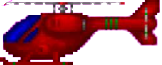

<!-- PROJECT LOGO -->
 

  

  <h3 align="center">ProgramvareArkitektur</h3>

  

    SchoolProjects spring 2022
  

<!-- ABOUT THE PROJECT -->
## About The Project

Basic startertask around android studios

Here's some key features:
* Learning about sprites

  

<!-- GETTING STARTED -->
## Getting Started

Download android studios and run the program either on a virtual android phone or in desktop mode

### Built With

* Java
* html
* css

<!-- CONTACT -->
## Contact

Skjalg Nysaeter - skjalgn@gmail.com

Project Link: [https://github.com/skjalgn/ProjectSpotify](https://github.com/skjalgn/ProjectSpotify)

(<a href="#readme-top">back to top</a>)

